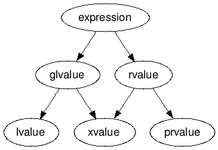

# STL

## 1주차 - 03/05 
### Generic Programming
자료형과 관련 없는 프로그래밍
템플릿함수, 템플릿클래스 

기능을 표현하는것. 자료형은 중요하지 않음
자료형에 관계없이 절차를 기술 -> 알고리즘

템플릿 함수 -> 알고리즘
클래스 -> 자료구조


## 2주차 - 03/11
### contiguous memory
공간상 연속성   
데이터를 가져올때 주변 데이터를 통으로 가져오기 때문에 빠르다.  
T[N] 형식의 배열은 POD(Plain Old Data)  
쓰지 마라!  
array를 대신 써라

### continuous memory
시간적 연속성  


## 2주차 - 03/12
DMA(Direct Memory Access) 명령은 CPU의 개입 없이 메모리에 접근해서 
데이터를 읽거나 쓰는 명령이다.  
때문에 CPU인터럽트를 발생시키지 않고 메모리에 접근할 수 있다.  

|open모드|읽고 쓰기|
|---|---|
|text|고수준(<<, >>)|
|binary|저수준(read, write)|

보통 고수준, 저수준 끼리 짝을 맞춰 쓴다(섞어쓰지 않는다)


## 3주차 - 03/19
windows의 메모리 구조  

낮은주소

|구조|
|:---:|
|stack|    
|...|  
|...|  
|free store|
|code|  
|data|  

높은주소  

인터넷에 검색해서 나오는 그림이랑은 좀 다르다.  

실행 사이클
fetch -> decode -> execute   ->   writeback  

스택에 많은 데이터를 쌓지 마라. 힙에 넣어라.  

전역변수를 초기화 안하고 실행파일을 만들면(초기화하지 않은 data == default로 초기화한 data)
실행파일에는 '400MB를 default로 초기화 하는 code' 만 기록된다.
('초기화하지 않은 전역 DATA영역' 이 잡힌다.)
근데 하나라도 초기화하면 메모리image를 캡쳐해서	실행파일에 저장하고,  
실행시 이 이미지를 그대로 DATA영역에 저장한다.  
그니까 전역변수 초기화는 왠만하면 하지 마라.  


## 4주차 - 03/25
메모리 매니저가 메모리 할당을 관리한다.  
메모리가 잡혀있는건지 링크드리스트로 표시  
단편화  

메모리 용량을 초과한 메모리 할당을 할때  

- RAII(Resource Acquisition Is Initialization)  
  > RAII idiom - 메모리, 파일, jthread  
- Stack unwinding    
  > 예외가 발생하더라도 자원을 해제한다.   

https://www.youtube.com/watch?v=Rfu06XAhx90&ab_channel=CppCon  

## 4주차 - 03/26
ostreambuf_iterator, istreambuf_iterator  
qsort: C함수이지만 제네릭 

## 5주차	 - 04/01
NlogN 에서 log는 2를 밑으로 하는 로그  
함수호출 연산자 function call operator: operator()
```cpp
class Dog {
    int m;

public:
    bool operator()(int a, int b) {
        m++;
        return a > b;
    }
};
```
이러한 객체는 함수 호출처럼 사용할 수 있지만 상태를 가질 수 있다.  
함수형 언어에서는 이러한 형태는 지양된다.  

callable type - 무한한 타입이 있다.  
1. 함수 포인터
2. 람다
3. ()연산자(function call operator)를 오버로딩한 클래스의 객체  
셋다 코드영역에 있다.(3의 경우 객체의 ()연산자)

```cpp
class lambda {      // mangling됨
public:
    void operator()() {
        cout << "람다의 정체? (vs에서는)function object" << endl;
    }
};
```

이 다양한 타입들을 호환되게 하기 위해 function을 만들었다.  
function은 호출 가능한 타입을 대표한다.  
```cpp
void f(function<bool(int, int)> x) {
    cout << x(3, 5) << endl;
}
```

## 5주차 - 04/02


## 6주차 - 04/08
Container(자료구조) - class template  
> "Containers are objects that store other objects." - 표준문서 중  
1. Sequence Container  
  - `array<T, N>`
  - `vector<T>`
  - `deque<T>`
    > 양쪽으로 확장 가능  
  - `forward_list<T>`
    > 싱글 링크드 리스트  
  - `list<T>`
2. Associative Container
3. Unordered Associative Container  
기타: Stack, Queue, Float, Set, Map, ...  

Algorithm - function template  
1. Non-modifying
2. Modifying
3. Sort  
기타: Numeric, ...   

컨테이너와 알고리즘이 iterator를 통해 상호작용  
알고리즘이 컨테이너의 시작, 끝, 다음을 알게 해준다.  
`Iterator Pattern`  
`OCP(Open-Closed Principle)`  


`component pattern`?  

## 6주차 - 04/09
vector의 구조: 크기, 데이터, 재할당하지않고 관리할 수 있는 원소의 개수  
  > size, data, capacity  
capacity는 이전의 1.5배가 된다.  

재할당 보는 과정에서 교수님은 복사가 일어나는데 나는 안일어난다  
뭐임?? 


## 7주차 - 04/15
재할당 보는 과정에서 교수님은 복사가 일어나는데 나는 안일어나는거  
noexcept 때문이었다.  
> 벡터 내의 데이터 이동시에 예외가 발생하면 원본이 훼손될 수 있다.  
> 이런일을 방지하기 위해 복사를 한다.  
> noexcept를 붙이면 이런 예외가 발생하지 않는다고 알려주는 것이다.  

remove: 삭제하지 않고 뒤로 밀어버린다. 따라서 크기를 직접 줄여줘야 한다.  
```cpp
// erase-remove idiom
v.erase(remove(v.begin(), v.end(), 3));
```

## 7주차 - 04/16
그냥 `erase(container, value)` 쓰면 된다.  

`vector<int> v(100);`와 `vector<int> v { 100 };`는 다르다  
100개를 넣거나 100을 넣거나  

`erase_if(container, lambda)`
`auto result = v | views::filter([](int n) { return n % 2 == 0; });`

`vector::insert`는 있지만 쓰지 마라.  

deque - vector와 list의 중간형태를 띄는 자료구조(stl에서)  
4개씩 묶여서 할당된다.  


- vector: 메모리상 연속된 위치  
- deque: n개씩 연속된 위치
- list: 연속되지 않은 위치

> amortized constant time: 평균적으로 상수시간

list의 단점: 임의접근 불가, 포인터(prev, next)로 인한 메모리 소모  

deque이 vector보다 많은 값을 담을 수 있다 -> 나눠진 영역에 할당이 가능해서  

list보다 낭비가 덜하고 빠르다
vector보다 유연한 할당이 가능하다


## 8주차 - 04/22
list  
sort로 정렬을 하려면 뺄셈 가능한 반복자를 알려줘야한다.  
그래서 list는 못한다.  
하려면 list::sort를 이용해야한다.  
정렬을 하면 가리키는 포인터만 바뀌므로 관찰 메시지가 나오지 않는다.  
이 정렬은 동등한(equivalent) 원소에 대해 순서를 유지한다.(stable sort)  

역방향 반복자 r~~  
https://en.cppreference.com/w/cpp/iterator/reverse_iterator 


## 9주차 - 04/30
list  
- splice: 리스트 합침
- merge: 정렬된 리스트 합침, stable하게
- sort: 정렬
- unique: 중복 원소 제거

문자열 비교: Lexicographical comparison

`forward_list`: singly linked list
C스타일로 작성된 singly linked list보다 시간, 공간적 오버헤드가 많지 않다

`span`?
char[], string, vector 등 메모리가 contiguous한 것들을 한가지 통일된 방식으로 표현할 수 있게 한 클래스


## 10주차 - 05/06
stl의 구성요소?  
- container
- algorithm
- 이 둘을 연결하는 iterator

`void f()`, `class X::operator()`, `[](){}` 등을 대표하는 `function`  
`char*`, `char[]`, `const char*`, `string` 등을 대표하는 `string_view`  
`int[]`, `array`, `vector` 등을 대표하는 `span`  

iterator: Iterators are a generalization of pointers  
  포인터를 일반화한 것.  
  이걸 사용하면 자료구조가 뭔지에 관계 없이 동일한 방식으로 코딩 가능  

named requirement: 지켜야할 사항?  
> `concept`: named requirement를 표현하는 것?  

- LegacyInputIterator
- LegacyOutputIterator
- LegacyForwardIterator
- LegacyBidirectionalIterator
- LegacyRandomAccessIterator
- LegacyContiguousIterator

`Iter::iterator_concept`  
`Iter::iterator_category`  

`iterator_concept`는 contiguous한 컨테이너의 iterator에만 있다.  

SFINAE: Substitution Failure Is Not An Error  
  > 컴파일러가 함수 템플릿의 인자를 대입하려고 할 때, 대입이 불가능하면 그 함수 템플릿은 후보에서 제외한다.  
  > 그래서 컴파일 에러가 나지 않는다.  


## 10주차 - 05/07
대부분의 디자인패턴은 우회로.  

C++ 표준을 지키는 반복자가 되려면 다음 다섯가지 항목을 정의해야 한다.  
- `difference_type`: 두 반복자 사이의 거리를 나타내는 자료형?
- `value_type`: 값의 자료형?
- `pointer`: 포인터?
- `reference`: ?
- `iterator_category`: 어떤 종류의 반복자인지


## 11주차 - 05/13
sort알고리즘은 인자로 받은 반복자가 random access가 가능하다고 가정한다.  
random_access_iterator는 +=, -= 연산자를 지원한다?  

l-value: left-value였는데 location-value로 바뀌었다? 저장위치를 찾을 수 있는 값?  

  
이거 잘 봐라  

`method();`랑 `method() const;`랑 다르다. 오버로딩 가능하다.

